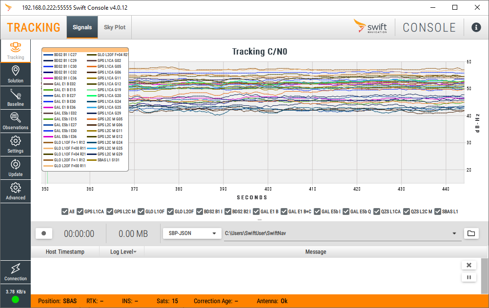

# Swift Toolbox 🧰

[](https://github.com/swift-nav/swift-toolbox/actions/workflows/main.yml)

## Introduction

This is the open source repository for code that implements the Swift Navigation Console.  **Releases hosted on this page are provisional and are _NOT_ official releases.**  For official (and supported) releases please visit [our downloads page](https://swiftnav.com/latest/swift-console) and see [our guide](https://support.swiftnav.com/support/solutions/articles/44001903699-installing-swift-console) on how to install the application.



## Development Setup

Install Rust: https://rustup.rs/

Install *cargo-make*: `cargo install --force cargo-make`.

Set up standalone Python environment:

```
cargo make setup-builder
```

Install cmake, clang, and capnp in your respective OS.

```
# Windows - install with installer, or via chocolatey
choco install cmake llvm capnproto zstandard

# Mac
xcode-select install
brew install cmake capnp zstd create-dmg wget

# Linux
apt install cmake libclang-dev capnproto zstd
```

Install ImageMagick:
```
# Windows
choco install imagemagick

# Mac
brew install imagemagick

# Linux
apt install imagemagick
```

### Troubleshooting building for macOS

The module used for generating rust bindings for native libraries; `rust-bindgen`
has been observed to fail to find system headers (i.e. `assert.h`, `math.h`) on
newer versions of macos. Fortunately we can add include search paths to pass to
clang by setting an environment variable:

```
export BINDGEN_EXTRA_CLANG_ARGS=-I$(xcrun --show-sdk-path)/usr/include
```

## Running

To run the app (in dev mode):

```
cargo make run
```

Or in "prod" mode (compiles a wheel for the backend):

```
cargo make prod-run
```

### (Debug) Recording a stream from the backend.
If you are interested in debugging the frontend, you can first record a capnp recording.
Either connect to a device via the GUI or command line and include the flag:
```
--record-capnp-recording
```
This will save a `.pickle` file in your current working directory.

**NOTE:** Use of this recording is intended only for debugging the swift-console and not for
long term storage of streams. There is no guarantee the recording will be compatible with
other console versions, as the messaging format between backend and frontend has no guarantee
of backwards or forwards compatibility.

Debugging internal messaging should be version specific and recording it should be tied
to its version.

### (Debug) Replaying a stream from the backend in frontend (with or without Rust).
If you have recorded a capnp recording pickle file as shown in the previous step, now you
can replay this file. If you already have the standard development environment set up, you
can simply use the command line flag:
```
--read-capnp-recording <path/to/pickle-file>
```

If you want to run the application without the standard development envionrment.
```
# Set up a python 3.8 environment.

# Install flit for generating a wheel from our pyproject.toml.
pip install flit

# Generate the wheel.
python -m flit build --no-setup-py

# Install the wheel.
pip install dist/swiftnav_console-0.1.0-py3-none-any.whl --force-reinstall

# Generate our resources file (may need to manually point to this binary installed by PySide6).
pyside6-rcc resources/console_resources.qrc -o swiftnav_console/console_resources.py -g python

# Run the application.
python -m swiftnav_console.main --read-capnp-recording path/to/pickle-file

# Note some of these calls may be different if you are attempting on windows,
# assume binaries end with ".exe". May also need to direct the correct python pip
# depending on how your python 3.8 environment is set up.
```

## Building the distribution (and optionally create installer)

```
cargo make create-dist

# In order to create an installer:
cargo make dist-to-installer
```

## Create a new release via CI
The main github actions workflow will detect a new tag was created. If all checks and builds 
succeed a new release will be made with all assests attached to it. This process typically 
takes about 40 minutes. Although any official release should be triggered off the main branch,
you can use this process to create a "test release" for debugging purposes (you can append a
moniker to denote the release is a test e.g. v4.0.6-test)

```
git tag vX.X.X && git push origin vX.X.X
```

## Running the benchmarks

Prerequisites:

- Windows
  - NSIS - Nullsoft Scriptable Install System
  - NSIS ShellExecAsUser plugin
- All
  - `cargo install hyperfine`

To run the frontend benchmarks:

```
git lfs pull
cargo make create-dist
cargo make frontend-cpu-bench
```

## QML Formatting
The `qmlformat` tool is not included in the Qt PySide6 pip packages so the quickest (only?) way to get the tool is by installing Qt on your machine. In CI, we rely on a quick installer tool `aqt` to achieve this.

* Create a python 3.7+ virtual environment:
  ```
  conda create -n qt python=3.10
  ```
* Install the `aqt` package:
  ```
  pip install aqtinstall
  ```
* Install the desired version of qt. This website will help you customize the install command for your machine, https://ddalcino.github.io/aqt-list-server/ . Here are some OS specific generic install commands (visit the website if you need a different architecture):
  ```
  # Linux
  aqt install-qt linux desktop 6.4.1 gcc_64
  # MacOS
  aqt install-qt mac desktop 6.4.1 clang_64
  # Windows
  aqt install-qt windows desktop 6.4.1 win64_msvc2019_64
  ```
* Add the `qmlformat` tool to your path. It is located in `<qt install dir>/<qt version>/<arch>/bin/`, this may be different depending on your system.

* Now you can run the tool, but use this cargo make command to match CI behavior:
  ```
  cargo make qml-format
  ```

## QML Profiling

Download the universal Qt installer from qt.io. Run the installer, pick custom
installation, and make sure that the Qt version installed matches the PySide6
version that is used for this project. Qt Creator will be automatically
installed.

Once done, start the app using `cargo make run --qmldebug` or
`cargo make qml-run --qmldebug`.

The application will indicate that the client application is waiting for a
socket connection from the QML debugger. This is displayed to stderr.
    ```QML Debugger: Waiting for connection on port 10002...```

Launch Qt Creator and load the project swift-toolbox.pyproject.

From the `Analyze` menu, choose `QML Profiler (Attach to waiting application)`.
Connect to the same port that is shown in the shell you started the toolbox
from.

The application should now start-up and can be used. Perform whatever actions
for which you wish to capture profiling information. Qt Creator's Profiler pane
will just be showing an elapsed timer counting up, with no information shown.
This is expected.

When you are done performing actions in the application, either click the red
"recording" circle button to stop the recording, or close the client
application.

Upon doing this, Qt Creator's QML Profiling view should show profiling data.

You now have profiling data for the session you can comb through in the Qt
Creator QML Profiling view that shows.

## QML Debugging

In order to enable QML debugging, add the command line option `-qmldebug`.
QML debugging does not entirely work currently for this project and
still needs to be fleshed out.  The internal tracking issue for this is
[CPP-400](https://swift-nav.atlassian.net/browse/CPP-400).

## Contributing

After making changes, run to tasks to ensure the code is ready for submission

```
# fetch test data
git lfs pull

cargo make check-all
cargo make tests
```

## Callgrind

It may be helpful to profile the application. To do this, you can use valgrind.
One mode of valgrind that is particularly useful is --callgrind.

In order to use this, you need to install valgrind in your favorite OS.
You can initiate this using the cargo make target `callgrind-run`.

Once you run the app with callgrind and quit the application, it will generate a
file named callgrind.out.\<unique id\>.

To analyze the results, use kcachegrind or qcachegrind, which you should be able
to find installable with your distribution's package manager.
Both are the same tool, just have slightly different dependencies. If you are
using KDE, install `kcachegrind`. If you are using Gnome, install `qcachegrind`.
Pass the `callgrind.out` file to the tool like so:
```
qcachegrind callgrind.out.163238
```

To dive into the source code, download the sources for the libraries you wish to
inspect (like Qt or Python), matching the exact version, and set the source
directories in QCacheGrind from the configuration dialog accessible from the
View menu (View-\>Configure...-\>Source Annotation-\>Add).

The Qt libraries contained in the PySide6 python module do not contain debug
symbols, and thus you see limited information from Qt when profiling. To add
debug symbols to this, download and install Qt from qt.io, matching the PySide6
version, and use the included `utils/symlink-qt-installer-libs-to-pyside6.sh`
script.

You can fetch the Qt source code either from the Qt installer, or from git
using the `v6.n.n` tags.

This has only been tested on Linux, but it should also work on macOS and
Windows.

Someone else may be able to expand this showing how to profile the Rust code.

## Technologies

### Rust

Rust is used for the "backend" logic of the application. The library [pyo3][]
(and companion library [setuptools-rust][]) are used to implement a native
Python extension.

[pyo3]: https://docs.rs/pyo3/0.13.1/pyo3/
[setuptools-rust]: https://github.com/PyO3/setuptools-rust

### PySide6

We're using Qt 6 via PySide6 (the official Python bindings for Qt).

### QML

QML (QtQuick Mark-up Language) is used to model the UI.

### Python 3.11 Standalone Build

[python-build-standalone](https://github.com/indygreg/python-build-standalone) provides
redistributable builds of Python, these builds are designed to function in a variety
of generic Linux, Windows and macOS environments.

## Design Philosophy

### Installers, resources and packaging

One of the things that made the old console difficult to maintain was the
number of Python dependencies that were required to implement the console. In
particular things like the `TraitsUI` library bound us to particular versions of
PyQt that worked well with `TraitsUI`. Additionally, if we wanted to use new libraries,
PyInstaller's "hooks" needed to be up-to-date enough to work with these
libraries (see [PyInstaller hooks][] for reference).

[PyInstaller hooks]: https://github.com/pyinstaller/pyinstaller/tree/develop/PyInstaller/hooks

PyInstaller can be a great way to package a massive framework like Qt,
but it still requires PyInstaller to process and package your application,
which creates an environment where your deployed app isn't quite the same
as your development app.

In the current framework don't use PyInstaller, but rather rely on the 
redistributable nature of the "Python standalone" build to create a build
of the app that is usable for both development and distribution.  The
Python standlone build can be packaged up and dropped onto a user's sytem
as a simple zip file, or via a standard installer technology like NSIS/MSI,
DEB/RPM or a macOS app bundle.

If we didn't bundle dependencies like Qt, we would have to rely on Qt
being present on Unix like systems via package dependencies, and on
other systems we need to use tools like [macdeployqt][] and [windeployqt][].  

[macdeployqt]: https://doc.qt.io/qt-5/macos-deployment.html#the-bundle
[windeployqt]: https://doc.qt.io/qt-5/windows-deployment.html

Also in service of this goal, it makes sense to minimize the number of
dependencies that we use for Python in order to avoid this problem.
This ends up "dovetailing" well with the usage of Rust as the UI backend.
Rust's package management prefers static linking, so depedencies are
wrapped up into a single redistributable object, which makes distribution
to client machines easier.

Resource management is another concern, for non-code assets like pictures,
protocol definitions (`.capnp` files) and UI mark-up files (`.qml`) we need a
system to bundle these -- we use Qt's resource system (via [qrc][]) but we
could use things like Rust's [`include_bytes!`][rust_include].

[qrc]: https://doc.qt.io/qt-5/resources.html
[rust_include]: https://doc.rust-lang.org/std/macro.include_bytes.html

To this end the original prototype of this app attempted to impose these constraints:

+ Minimal dependencies in Python: only Qt (via PySide6) and Capnproto (pycapnp)
+ All other necessary external libraries should be include via Rust libraries

### QML - minimizing dependence on Python

The QtQuick Mark-up Language (QML) is used to code the UI.  QML provides an
abstraction layer for describing the UI that doesn't require the UI to be hand
coded in any particular language.  While Qt already has support for this
through their UIC files, QML also provides support for display logic to be
directly embedded in the QML file via JavaScript - this helps with the
portability of the QML since UI logic doesn't need to be encoded in the
language hostign the QML.

To this end the prototype attempts to imposes these constraints:

+ No UI logic in Python if possible, UI logic should be encoded in small bits
  of JavaScript ([example][ui-javascript])
+ Python code should focus on "data binding" and "message passing" only
  - For "data binding", this means Python code should be what's minimally
    necessary for Qt to fetch display data
  - For "message passing", to implement features, Python code will need to
    be written to pass data to the backend, and to marshal data from the
    backend into the data binding objects.

[ui-javascript]: https://github.com/swift-nav/swift-toolbox/blob/4c8736ddc938f2937fafde778c36fcfb3cc2c806/resources/SolutionTabComponents/SolutionPositionTab.qml#L359

#### pyqtdeploy

The *pyqtdeploy* project: https://pypi.org/project/pyqtdeploy/ -- from the
same people that maintain PyQt5 (not Qt/Nokia) is designed to allow PyQt5
applications to deploy to desktop and mobile environments, however the
project page emphasizes that the project was designed specifically around
allowing the PyQt5 apps to be deployed to iOS and Android.

#### Rust or C++ application host

It's possible that we can build a C++ shell that hosts the QML, and
re-implements the "data binding" and "message passing" code if deploying with
something like *pyqtdeploy* is not sucessful, or proves to be prohibitive.
This would allow us to remove Python from the mix completely.  Projects
like Rust's [qmetaobject](https://docs.rs/qmetaobject/latest/qmetaobject/)
may make this possible too.

### Rust backend

The rust backend gives us a statically type checked, modern programming
language with enough library support to support our development activities.
The "big" libraries that the current console uses are *numpy* and *pyserial*.

The equivalents for Rust are:

+ [serialport](https://docs.rs/serialport/4.0.0/serialport/)
+ [ndarray](https://docs.rs/ndarray/0.14.0/ndarray/)

Using Rust should give us a head start on speed and resource usage issues.
However, we don't want to be bound to tightly with any particular FFI system.
To that end, we integrate into Python with [pyo3][] but we try to minimize
the dependence here by driving most of the interaction with the back-end via
message passing. This gives the backend greater portability should we need to
move to different application host (Rust/C++) for Qt/QML or a different UI system
altogether (e.g. we could build native UIs for Android/iOS).

To this end the prototype attempts to imposes these constraints:

+ Most interaction with the backend should be via message passing
+ FFI with the host language (Python) should focus on start/stopping the
  backend and exchanging lightweight IPC messages (capnproto)

### Message passing

We use [capnproto][] for message passing since it does not require parsing,
the in memory representation is accessed directly by the library, without an
unpacking/parsing step -- this makes it suitable for "high speed" scenarios like 
in memory IPC (where it's preferable to not pay the compute cost of parsing
just to cross language barriers). Other formats like protobufs require a parsing
phase -- capnproto also has very ergonomic Python bindings. Other formats such as
[flatbuffers][] achieve similar goals as *capnproto* but do not have good
Python support.

**We do not intend on allowing backward compatibility** in internal message passing via
capnproto. There may be releases that modify internal message structures and should 
not be relied on even though these internal packets are being exposed.

[capnproto]: https://capnproto.org/
[flatbuffers]: https://google.github.io/flatbuffers/


### Mapping support

To modify map: https://github.com/swift-nav/swift-toolbox/tree/main/resources/web/map/js/trajectory_raw.js 
`Makefile.toml` uses task called `map-js-token` to replace `@ACCES_TOKEN@` in trajectory_raw.

Fill environment variable `MAPBOX_TOKEN` before any resource generation (compile / run) will populate the access token.

## LICENSE

Copyright © 2021-2022 Swift Navigation

Distributed under the [MIT open source license](LICENSE).
